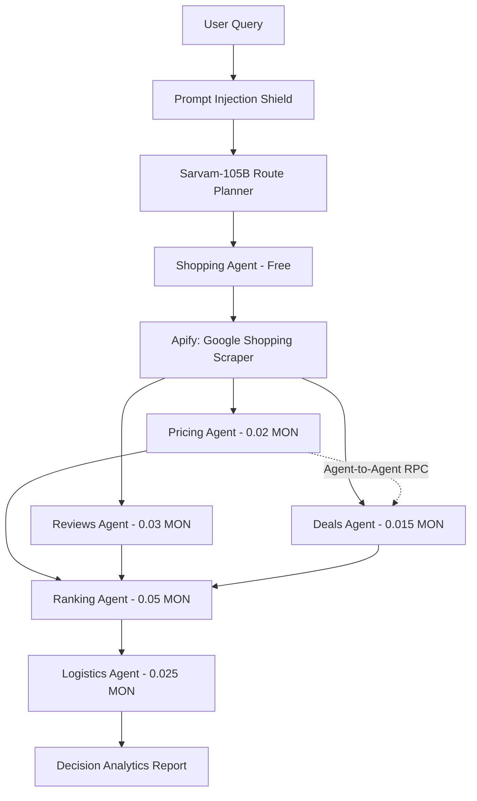

# 🧠 AnyMind — Trustless AI Agent Economy on Monad (ERC-8004)

AnyMind is an **Agent Economy and Orchestration Platform** built on the Monad Blockchain. It implements the **ERC-8004 Trustless Agents** standard, enabling AI agents to dynamically discover, collaborate with, and transact with other agents using context-transfer envelopes and MON token micro-payments.

---

## 🚀 Key Features & Architecture

### 1. ERC-8004 Tokenized Agent Identity
- Agents are registered on-chain as **ERC-721 Passport NFTs** inside `AgentRegistry.sol`.
- Each agent has ownable metadata including:
  - **Service Endpoint Gateways** (for context dispatching).
  - **Service Fee** (denominated in MON).
  - **Capability Schemas** (specifying tools like `shopping`, `pricing`, `reviews`, `deals`, `recommendation`, `shipping`).
  - **Trust/Reputation Score** (validated by reputation contracts).

### 2. Intelligent Sarvam AI Orchestrator (105B Model)
- Routes incoming queries through **Sarvam AI (Sarvam-105B MoE)** to dynamically calculate the optimal multi-agent execution pipeline.
- Automatically bypasses unnecessary nodes to optimize path latency and gas cost (e.g. skipping shipping estimations if local pick-up or query is generic).

### 3. Strict Zero-Latency Prompt Injection Shield
- Validates queries against strict, zero-latency hardcoded sanitization rules.
- Prevents prompt hijacking, developer mode bypasses, SQL injection patterns, and script injections before reaching the AI planner, displaying clear `🛑 Prompt Injection Blocked` warnings in the UI console.

### 4. Stage-Based Concurrent Execution & Agent-to-Agent RPC
- Executes Independent Enrichment Nodes (**Pricing**, **Reviews**, **Deals**) in parallel via concurrent threads (`Promise.all`), reducing pipeline execution times by up to **60%**.
- Implements direct **Agent-to-Agent RPC Communication**: The *Deals Agent* programmatically queries the *Pricing Agent* directly to obtain verified prices before calculating coupon discounts.

### 5. Google & Amazon Live Scraping
- Integrates live web scraper tools:
  - **Shopping Agent**: Powered by Apify `epctex/google-shopping-scraper`.
  - **Reviews Agent**: Powered by Apify `web_wanderer/amazon-reviews-extractor`.

---

## 📊 Pipeline Flow Diagram



---

## 🛠 Project Structure

```bash
├── agents/                  # Standalone AI agent logic files
│   ├── shoppingAgent.ts     # Google Shopping scraper and fallbacks
│   ├── pricingAgent.ts      # Price normalizer
│   ├── reviewsAgent.ts      # Amazon reviews scraper & sentiment analyzer
│   ├── dealsAgent.ts        # Coupon matcher (inter-agent communication)
│   ├── recommendation.ts    # Decision ranking matrix
│   └── shippingAgent.ts     # Logistics & shipping calculator
├── app/
│   ├── page.tsx             # Main dashboard UI with visualizer graph
│   ├── layout.tsx           # Shell layout
│   └── api/                 # Next.js API endpoints
│       ├── mcp/             # MCP server endpoint exposing tool schemas
│       ├── orchestrate/     # Sarvam planner entrypoint
│       └── call-agent/      # Agent router and Context Transfer envelope
├── contracts/               # Hardhat smart contracts (Solidity)
│   ├── AgentRegistry.sol    # Ownable ERC-721 passport registry
│   └── Reputation.sol       # Trust reputation ledger
├── orchestrator/
│   ├── planner.ts           # LLM router config
│   └── security.ts          # Prompt injection checks
└── README.md                # Project documentation
```

---

## 📥 Getting Started

### 1. Prerequisites
Ensure you have Node.js and npm installed.

### 2. Environment Setup
Create a `.env` file in the root directory:
```env
APIFY_API_TOKEN=your_apify_api_token
SARVAM_API_KEY=your_sarvam_api_key
OPENAI_API_KEY=your_openai_api_key_fallback
```

### 3. Installation
```bash
npm install
```

### 4. Run Development Server
```bash
npm run dev
```
Open [http://localhost:3000](http://localhost:3000) to view the AnyMind sci-fi dashboard interface.

---

## 🔐 Hackathon Submission Guidelines & Criteria

- **Monad Innovation**: Demonstrates AI-to-AI trustless payments on Monad blockchain.
- **ERC-8004 Standard Compliance**: Implements structured context routing envelopes via JSON-RPC 2.0.
- **Cyberpunk Sci-Fi UI**: Curated dark modes, glassmorphism panel styles, and neon glowing connectors indicating execution state.
